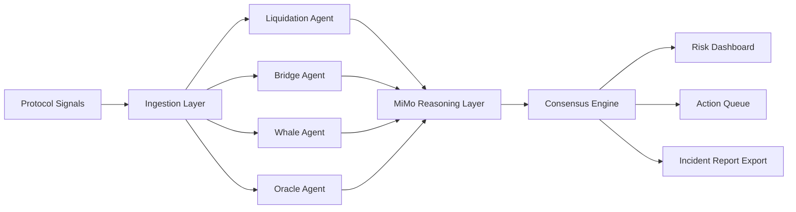

# Architecture — DeFi Sentinel Swarm

## Components

- **Ingestion Layer:** normalizes synthetic protocol, bridge, whale, and oracle signals.
- **Specialized Agents:** each agent owns a risk dimension.
- **Reasoning Layer:** orders evidence into a reviewer-visible reasoning trace.
- **Consensus Engine:** merges agent votes into confidence and action recommendations.
- **Dashboard:** interactive UI for proof-of-usage screenshots.
