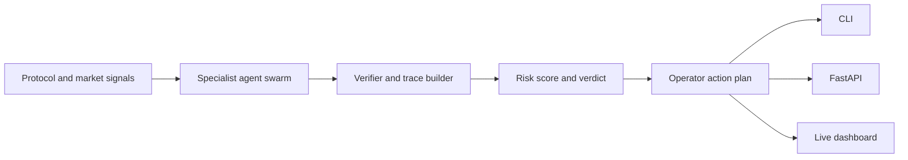

<p align="center">
  
  
  
  
</p>

<h1 align="center">DeFi Sentinel Swarm</h1>
<p align="center"><b>Autonomous multi-agent risk desk for liquidity shocks, oracle anomalies, bridge stress, and liquidation cascades.</b></p>

<p align="center">
  <a href="#what-this-is">What this is</a> •
  <a href="#product-surface">Product surface</a> •
  <a href="#operator-demo">Operator demo</a> •
  <a href="#architecture">Architecture</a>
</p>

---

## What this is

DeFi Sentinel Swarm is a beta-usable agent product, not a static landing page. It combines a live DeFi dashboard with a deterministic specialist-agent runtime, CLI console, API boundary, scenario fixtures, documentation, and automated tests.

Primary users: protocol risk teams, DeFi treasury operators, and analysts who need fast explainable incident triage without private keys or paid model access.

## Product surface

- Reasoning core: `backend/swarm.py` models specialist agents, confidence, trace IDs, risk scoring, and action plans.
- CLI console: `python3 cli.py --all` generates JSON reports locally.
- Markdown export: `python3 cli.py --signals examples/operator_override.json --format markdown` creates operator-ready incident notes.
- API boundary: `backend/app.py` exposes `/health`, `/scenarios`, `/analyze`, and `/demo-report` for hosted integration.
- Live dashboard: `index.html` fetches DeFiLlama protocol/yield data and performs browser-side risk analysis.
- Quality gates: 13 tests cover core runtime, CLI behavior, API contract, trace determinism, and executable demo paths.

## Agent team

- Liquidity Sentinel — watches pool depth and capital-flight pressure.
- Oracle Divergence Analyst — flags stale or divergent pricing signals.
- Bridge Exposure Mapper — maps bridge outflow stress and cross-chain blast radius.
- Liquidation Cascade Forecaster — estimates liquidation queue pressure.
- Treasury Action Planner — emits operator next-actions with traceable assumptions.

## Operator demo

```bash
git clone https://github.com/arzillaputriutami-sketch/agent-defi-sentinel.git
cd agent-defi-sentinel
python3 cli.py --all
python3 cli.py --scenario "oracle feed divergence"
python3 cli.py --signals examples/operator_override.json --format markdown
python3 -m pytest -q
```

Optional API mode:

```bash
python3 -m venv .venv
. .venv/bin/activate
pip install -r requirements.txt
uvicorn backend.app:app --reload
```

Example API calls:

```bash
curl http://127.0.0.1:8000/health
curl http://127.0.0.1:8000/scenarios
curl -X POST http://127.0.0.1:8000/analyze \
  -H 'content-type: application/json' \
  -d '{"scenario":"oracle feed divergence","signals":{"oracle_spread_bps":120}}'
```

## Verification

Current local quality gate:

```text
13 passed in 0.46s
```

Smoke checks:

```bash
python3 backend/swarm.py > /tmp/swarm.json
python3 -m json.tool /tmp/swarm.json >/dev/null
python3 cli.py --scenario "oracle feed divergence" > /tmp/defi-cli.json
python3 -m json.tool /tmp/defi-cli.json >/dev/null
```

## Architecture



## Repository map

```text
backend/swarm.py                 Multi-agent reasoning engine
backend/app.py                   Optional FastAPI service boundary
cli.py                           Local operator console, JSON + Markdown
index.html                       Static live DeFi dashboard
examples/sample_scenario.json    Basic fixture
examples/operator_override.json  High-stress operator fixture
tests/test_swarm.py              Core runtime tests
tests/test_cli.py                CLI and Markdown tests
tests/test_api_contract.py       API route contract tests
docs/ARCHITECTURE.md             Runtime architecture
docs/PRODUCT_SPEC.md             Product requirements and roadmap
Makefile                         test/smoke/demo shortcuts
```

## Roadmap

- [x] Live DeFiLlama dashboard
- [x] Multi-agent reasoning core
- [x] CLI demo flow
- [x] Markdown incident export
- [x] API boundary
- [x] CI tests
- [ ] Real-time connector adapters
- [ ] Hosted report export
- [ ] Human approval workflow

## License

MIT.
